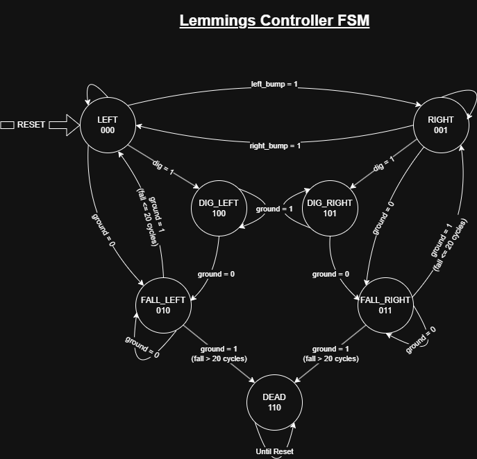
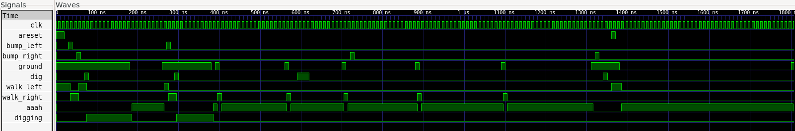

# Lemmings Controller FSM

A Moore Finite State Machine (FSM) implementation of the classic Lemmings walking behaviour in Verilog.

This project extends the HDLBits Lemmings FSM exercises by providing a complete standalone implementation with documentation, verification, and simulation.

---

## Problem Statement

Design and implement a synchronous Finite State Machine (FSM) that models the movement and actions of an autonomous game character (Lemming). The controller must manage the character's movement and actions based on environmental inputs.

The controller shall:
- Walk left or right while on solid ground.
- Reverse direction upon encountering an obstacle.
- Fall when the ground disappears while remembering the previous walking direction.
- Resume walking in the same direction after landing, provided the fall duration does not exceed the safety threshold.
- Enter a digging state when commanded while standing on solid ground.
- Continue digging until the ground beneath disappears.
- Count the number of clock cycles spent falling.
- Transition to a permanent DEAD state if the fall duration exceeds 20 clock cycles.
- Support asynchronous reset, forcing the controller into its initial state (walking left).

---

## Features

- Walking left and right
- Direction reversal on collision
- Digging state
- Falling state
- Fall duration counter
- Splatters after falling for more than 20 clock cycles
- Asynchronous reset
- Self-checking test bench
- GTKWave waveform generation

---

## Repository Contents

```
Lemmings_Controller_FSM/
├── README.md
├── lemmings.v
├── lemmings_tb.v
├── docs/
│   ├── SYNTHESIS_REPORT.md
│   ├── state_diagram.png
│   ├── waveform.png
│   └── lemmings.svg
└── synthesized.v
```

---

## State Diagram

<p align="center">

</p>

---

## FSM States

| State | Description |
|--------|-------------|
| LEFT | Walking left |
| RIGHT | Walking right |
| FALL_LEFT | Falling (previously walking left) |
| FALL_RIGHT | Falling (previously walking right) |
| DIG_LEFT | Digging (previously walking left) |
| DIG_RIGHT | Digging (previously walking right) |
| DEAD | Lemming has splattered |

---

## State Encoding

| State | Encoding | Binary |
|-------|----------|--------|
| LEFT | 3'd0 | 000 |
| RIGHT | 3'd1 | 001 |
| FALL_LEFT | 3'd2 | 010 |
| FALL_RIGHT | 3'd3 | 011 |
| DIG_LEFT | 3'd4 | 100 |
| DIG_RIGHT | 3'd5 | 101 |
| DEAD | 3'd6 | 110 |

---

## Output Encoding

Outputs are represented as:
```
{walk_left, walk_right, aaah, digging}
```

| State | Output |
|-------|--------|
| LEFT | 1000 |
| RIGHT | 0100 |
| FALL_LEFT | 0010 |
| FALL_RIGHT | 0010 |
| DIG_LEFT | 0001 |
| DIG_RIGHT | 0001 |
| DEAD | 0000 |

---

## Testbench Coverage

The self-checking testbench verifies:
- Reset behaviour
- Left/right walking
- Collision handling
- Digging
- Falling
- Dig command during fall
- Safe landing
- Boundary case (20 cycle fall)
- Fatal fall (>20 cycles)
- Dead state persistence
- Reset recovery
- Fall duration counter

---

## Verification

The project was verified using:

- **Verilator** - RTL linting
- **Icarus Verilog** - Functional simulation
- **GTKWave** - Waveform analysis

### Simulation Waveform:

<p align="center">

</p>

### Running the Simulation:

Compile:

```bash
iverilog -o sim lemmings.v lemmings_tb.v
```

Run:

```bash
vvp sim
```

Open waveform:

```bash
gtkwave waveform.vcd
```

---

## Synthesis

The RTL was synthesized using **Yosys** to verify synthesizability and inspect the generated hardware implementation.

A detailed synthesis report, including the synthesis flow, inferred hardware resources, and observations, is available in **`docs/SYNTHESIS_REPORT.md`**.

Generated synthesis artifacts:

- `synthesized.v` – Synthesized gate-level netlist
- `lemmings.svg` – Auto-generated synthesized circuit schematic

---

## Tools Used

- Verilog HDL
- Verilator
- Icarus Verilog
- GTKWave
- Yosys
- WSL2

---

## Concepts Demonstrated

This project demonstrates:
- Moore FSM design
- Sequential logic design
- State transition implementation
- Counter integration with FSMs
- Self-checking Verilog testbenches
- Functional verification using GTKWave
- RTL linting using Verilator
- RTL synthesis using Yosys
- Hardware resource analysis

---

## Reference

Inspired by the HDLBits FSM design exercise (Lemmings4).

https://hdlbits.01xz.net/wiki/Lemmings4

---

## Author

**Aakash Bhardwaj**

Electronics and Communication Engineering Graduate