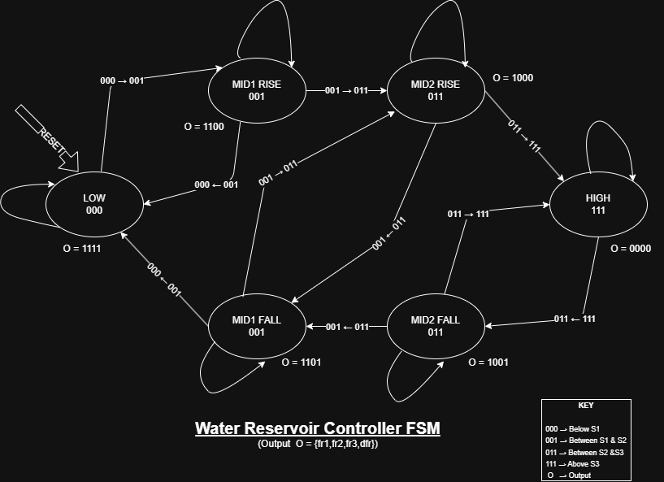
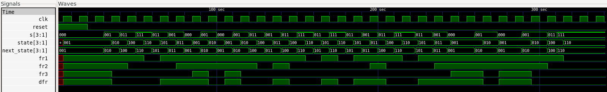

# Water Reservoir Controller FSM

A Moore Finite State Machine (FSM) implementation of a water reservoir controller in Verilog.

This project was developed as part of digital design practice while learning sequential logic and FSM implementation.

---

## Problem Statement

Design a Moore FSM that controls the water flow into a reservoir using three vertically placed level sensors.

The controller adjusts the nominal flow rate based on the current water level and enables an additional supplementary flow valve when the water level is falling.

The implementation includes:

- State transition logic
- Synchronous state register
- Moore output logic
- Simulation testbench
- GTKWave simulation waveform

---

## Repository Contents

```
Water_Reservoir_Controller/
├── README.md
├── state_diagram.png
├── waveform.png
├── water_reservoir_controller.v
└── water_reservoir_controller_tb.v
```

---

## FSM States

| State | Water Level | Description |
|--------|-------------|-------------|
| LOW | Below S1 | Reservoir level below the lowest sensor |
| MID1_RISE | Between S1 and S2 | Water level rising |
| MID1_FALL | Between S1 and S2 | Water level falling |
| MID2_RISE | Between S2 and S3 | Water level rising |
| MID2_FALL | Between S2 and S3 | Water level falling |
| HIGH | Above S3 | Reservoir full |

---

## State Encoding

| State | Encoding |
|--------|---------|
| LOW | 3'd1 |
| MID1_RISE | 3'd2 |
| MID1_FALL | 3'd3 |
| MID2_RISE | 3'd4 |
| MID2_FALL | 3'd5 |
| HIGH | 3'd6 |

---

## Output Encoding

Outputs are represented as:

```
{fr1, fr2, fr3, dfr}
```

| State | Output |
|--------|--------|
| LOW | 1111 |
| MID1_RISE | 1100 |
| MID1_FALL | 1101 |
| MID2_RISE | 1000 |
| MID2_FALL | 1001 |
| HIGH | 0000 |

---

## State Diagram

<p align="center">

</p>

---

## Simulation

The design was simulated using:

- Icarus Verilog
- GTKWave

The testbench verifies:

- Reset operation
- Rising water level transitions
- Falling water level transitions
- Direction reversals
- Asynchronous sensor input timing

---

## Simulation Waveform

<p align="center">

</p>

---

## Running the Simulation

Compile:

```bash
iverilog -o sim water_reservoir_controller.v water_reservoir_controller_tb.v
```

Run:

```bash
vvp sim
```

Open waveform:

```bash
gtkwave waveform.vcd
```

---

## Concepts Practiced

- Moore Finite State Machines
- Sequential Logic
- State Transition Design
- State Register Implementation
- Combinational Next-State Logic
- Moore Output Logic
- Verilog Testbench Development
- GTKWave Simulation and Debugging

---

## Reference

Problem inspired by the FSM design exercise from HDLBits (Water Reservoir Controller / ECE241 2013 Q4).

https://hdlbits.01xz.net/wiki/Exams/ece241_2013_q4

---

## Author

**Aakash Bhardwaj**

Electronics & Communication Engineering Graduate